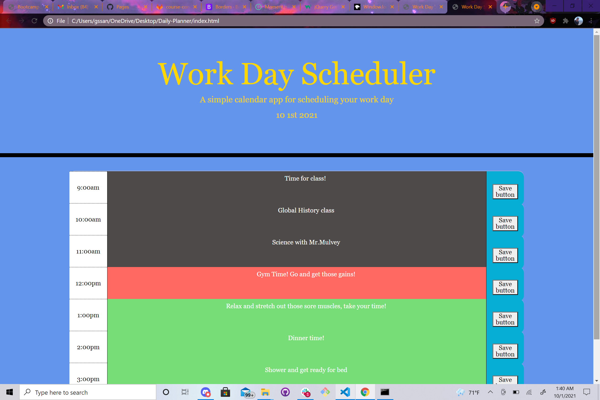

# Daily-Planner

This project is designed for users to be more efficent with scheudling a daily planner. This a planner designed to help users organize their time wisely and efficently. 

## Getting Started

The small column on the left indicates the time of the users event. The long horizontal row to the right of the time column shows users the event at that given time and allows users to interact with it and write their own events into it as they see fit. The far column on the right shows a save button allowing users to save their changes to their planner allowing them to customize it and save it if they wish. 

## Built With

* [HTML](https://developer.mozilla.org/en-US/docs/Web/HTML)
* [CSS](https://developer.mozilla.org/en-US/docs/Web/CSS)
* [Javascript](https://developer.mozilla.org/en-US/docs/Web/JavaScript)

## Deployed Link

* [https://gsandoval09.github.io/Daily-Planner/]

## Links

 

- [Link to Portfolio Site][https://gsandoval09.github.io/Professional-portfolio/]
- [Link to Github][https://github.com/gsandoval09]
- [Link to LinkedIn][https://www.linkedin.com/in/george-sandoval-4467641b3/]

See also the list of [contributors](https://github.com/your/project/contributors) who participated in this project.

## Acknowledgments

* Hat tip to Bootstrap
* Hat tip to w3Schools.com
* Hat tip to 

## Screenshot of site

